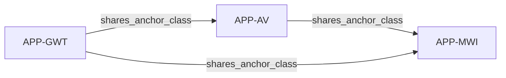

# Claim Graph

**Date:** 2026-08-12  
**Scope:** portfolio-wide (minimal seed)  
**Maintainer note:** First concrete fill of `templates/10_Claim_Graph.md`. Sparse on purpose — only edges already noted on application STATUS sheets.

*Optional overview. Individual worksheets remain the source of truth.*

---

## Nodes

| Node ID | Type | Short label | Status / FD (if known) |
|---------|------|-------------|------------------------|
| APP-MWI | Application | `2026-08_many-worlds-unitarity-preferability` | Provisional closed; Amb ≈ 5.5 |
| APP-AV | Application | `2026-08_av-e2e-vs-modular-preferability` | Stable Provisional closed; Amb ≈ 4 |
| APP-GWT | Application | `2026-08_llm-global-workspace-consciousness` | Live remnant Provisional-stable; Amb ≈ 2.5 (A-Weak) |

---

## Edges

| From | To | Relation | Notes |
|------|----|----------|-------|
| APP-AV | APP-MWI | shares_anchor_class | STATUS mutual “related”: uniqueness + preferability elevation pattern (not a hard depends_on) |
| APP-GWT | APP-MWI | shares_anchor_class | STATUS: strong uniqueness / sufficiency elevation vs MWI uniqueness+preferability (soft relatedness only) |
| APP-GWT | APP-AV | shares_anchor_class | STATUS: over-strong uniqueness / sufficiency-preferability pattern between GWT and AV |

---

## Optional diagram

---

## Residual judgment / known missing edges

- Most portfolio apps remain isolated; this graph does **not** claim dependency or import lineage.
- No Lock Library IDs yet — no `imports_lock` edges.
- Training Ladder fixtures omitted (not live portfolio lineage).
- FD scores not recorded here; gate sheets / FD worksheets remain authoritative if computed.

---

## Ready for next step?

- [x] Update after new application *(seeded with MWI + STATUS-related apps)*  
- [ ] Update after new lock  
- [ ] Freeze  
- [ ] Archive  
