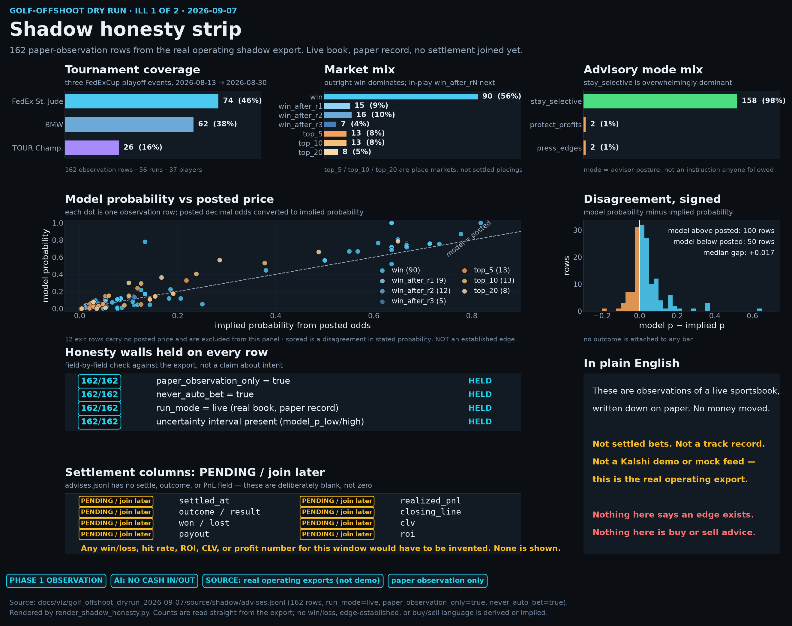
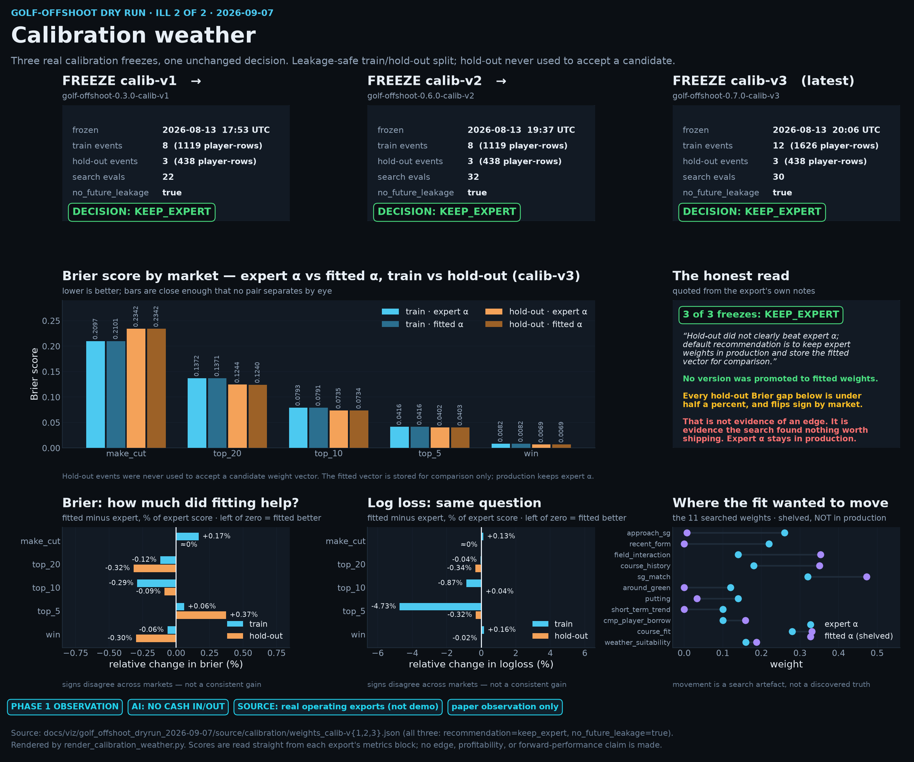

# Golf-offshoot dry run — Ill 1 + Ill 2 (2026-09-07)

Two illustrator boards rendered from **real operating exports** of the golf-offshoot
system. Not demo data, not mock feeds, not a Kalshi sandbox. The exports themselves
are checked in under [`source/`](source/) so every number on the boards can be
recomputed from this directory alone.

**Shared badges on both boards:**
`PHASE 1 OBSERVATION` · `AI: NO CASH IN/OUT` · `SOURCE: real operating exports (not demo)` · `paper observation only`

Ill 1 carries three additional board-specific badges, because it is the board that
now has settled paper outcomes on it: `NOT EDGE ESTABLISHED` · `NOT BANKED MONEY` ·
`SETTLE SOURCES: paper_ledger_ticket + espn_official_final`. There is deliberately no
board-level `SETTLE_PENDING` badge — the two residual rows are **excluded** as
`absent_from_official_field`, and they are named in place next to their own row
identifiers rather than badged across the board.

**Source path.** Both scripts read *only* from [`source/`](source/) in this directory.
Neither one reads, requires, or inspects the live operating journal at
`golf-offshoot/data/shadow/` — that path is the system's own working record and is
none of a docs board's business. Nothing here renders conditionally on whether it
exists.

---

## Ill 1 — Shadow honesty strip



`shadow_honesty_strip.png` (2640 × 4125 px) · rendered by
[`render_shadow_honesty.py`](render_shadow_honesty.py) from
[`source/shadow/advises.jsonl`](source/shadow/advises.jsonl) and
[`source/shadow/settle_join_summary.json`](source/shadow/settle_join_summary.json).

**Honesty caption.** 162 paper-observation rows written against a **live** sportsbook
across three FedExCup playoff events (FedEx St. Jude → BMW → TOUR Championship,
2026-08-13 → 2026-08-30), from 56 runs covering 37 players. Every row carries
`run_mode=live`, `paper_observation_only=true`, and `never_auto_bet=true`. "Live"
describes the book the prices came from, not money at risk: nothing was staked. The
advisory posture was `stay_selective` on 158 of 162 rows.

### The settle join (this board's refresh)

An earlier cut of this board drew every settlement column as `PENDING / join later`,
because the export genuinely had none. A real settle join has since landed, so the
board now reads the settle fields that actually exist — `settle_status`,
`settle_source`, `settled_at` — and nothing else. No value is inferred, modelled, or
back-filled by the renderer.

**Denominator convention.** The settleable denominator is **122** advises, and it is
fully joined: **34 `paper_win` / 88 `paper_lose` / 0 pending inside the denominator**.
There is no board-level `SETTLE_PENDING` badge. All 162 rows are accounted for, with
the honest reason each unsettled row carries no status:

| bucket | rows | why |
| --- | --- | --- |
| settled | 122 | `win` / `top_5` / `top_10` / `top_20`, settled off the real records |
| excluded, `absent_from_official_field` | 2 | player is not on the official `STATUS_FINAL` final field — non-settleable |
| `never_settled` | 38 | `win_after_r1/r2/r3` round-leader markets, never settled by design |

**The residual, named and excluded.** The two residual rows are both **Keith Mitchell**
at the **BMW Championship (`401811963`)** on 2026-08-17 — `top_10` (`rec-2853b9e721`)
and `top_20` (`rec-9643405947`), both `action_kind=new_bet`. He is not on the BMW
official final field, so no place finish exists to settle them against. Founder
Option A ([#144](https://github.com/swellbear/gated-formalization/pull/144)) adjudicates
exactly this case as `never_settled` with
`settle_source=espn_official_final:absent_from_official_field`: **non-settleable**, so
the rows are **dropped from the pending denominator** and are *not* board
`SETTLE_PENDING`. They are held *outside* the settleable denominator so they cannot
inflate or deflate the paper hit rate, and they are never defaulted to a loss to make
the board look finished — the staged export leaves their settle fields unset, because
nothing is known to write there. The board carries them as their own residual callout
panel, as an `absent_from_official_field` row in the out-of-denominator panel, and as an
honesty wall asserting both rows are still unset — never as a board-level badge.

**Round-leader nulls are not losses.** The 38 `win_after_rN` rows resolve
intra-tournament and the operating system never settles them. Their null status is by
design. The board shows them in their own out-of-denominator panel and counts them as
nothing; the renderer asserts that none of them ever acquires a `settle_status`.

**The hit rate is an observation, not an edge.** 34/122 ≈ **0.279** is the share of
*unplaced paper tickets* that would have come in. Wherever the figure is drawn it
carries an `OBSERVATION` · `NOT EDGE ESTABLISHED` · `NOT BANKED` chip row attached to
the number itself, so it cannot be screenshotted away from its qualifiers. It is not an
edge, not a validated edge, not ROI, not a track record, and not banked money — no
position was ever placed, so nothing was won or paid. The settle-mix panel is
deliberately coloured cyan/orange rather than green/red so a glance at it cannot read
as profit and loss.

**Reconciling with the staged summary.** `settle_join_summary.json` predates Option A:
it records `SETTLE_PENDING_cleared: false` against its own 124-row `relevant`
denominator, which still counts those two rows. Option A excludes
`absent_from_official_field` rows from that denominator — they must not keep a claim
blocked — which leaves the board's 122-row settleable denominator, and that one is fully
joined. So the staged `false` and the board's absent `SETTLE_PENDING` badge are not in
conflict; they are two different denominators, one of them superseded. The staged export
is **not** edited to make them agree; the board states the reconciliation in its footer
so a reader comparing the files is not left guessing.

**What the join delivered, and what is still absent.** `settle_status` and
`settle_source` are present on all 122 settled rows; `settled_at` is partial (33 of
162 — the `paper_ledger_ticket` rows carry an explicit stamp, the ESPN-final rows carry
the source but not one); 2 of 162 are unset, the excluded absent-from-field rows.
Absent from the export entirely:
`payout`, `realized_pnl`, `closing_line`, `clv`, `roi`, `stake_settled`. The board
marks those `ABSENT` rather than blank, and derives none of them from the win/lose
counts.

### Reading the rest of the board

**An `exit` is not a loss.** 52 of the 162 rows have `action_kind=exit`, and many of
those carry a negative `suggested_stake`. Read carelessly, that looks like a book of
closed-out positions. It is not. Every exit is an *advised* exit from a paper position
that was never placed, so settling it on paper realised nothing — no loss, no gain, no
money. The action-kind panel says so directly, because this is the single easiest thing
on the board to misread.

**Cadence is clustered, not scheduled.** The timeline panel places each row on its own
timestamp. Observations bunch into tournament weeks and go quiet between them; the
gaps are weeks with nothing worth writing down, not missing data.

**On the model-vs-market panel.** The scatter and the signed-gap histogram show where
the model's stated probability sat relative to the probability implied by the posted
decimal odds. That is a **disagreement between two stated numbers**, nothing more. It
is not a measured edge, not a validated edge, and not a reason to act — and the settle
join does not turn it into one. The histogram bars are deliberately *not* split by
`settle_status`: 122 paper outcomes are far too few to calibrate against, and the board
does not attempt it. 12 exit rows carry no posted price and are excluded from those two
panels; they are still counted everywhere else.

## Ill 2 — Calibration weather



`calibration_weather.png` (2640 × 2200 px) · rendered by
[`render_calibration_weather.py`](render_calibration_weather.py) from
[`source/calibration/weights_calib-v1.json`](source/calibration/weights_calib-v1.json),
[`v2`](source/calibration/weights_calib-v2.json), and
[`v3`](source/calibration/weights_calib-v3.json).

Unchanged by the Ill 1 settle refresh: the calibration freezes carry no settlement
fields, so this board and its badge strip are byte-for-byte what they were.

**Honesty caption.** Three successive calibration freezes — `calib-v1` (8 train
events), `calib-v2` (8), `calib-v3` (12, latest) — and all three landed on the same
recommendation: **`keep_expert`**. All three record `no_future_leakage=true`, and the
hold-out events were never used to accept a candidate weight vector.

Reading all three freezes matters more than reading the latest one. A single
`keep_expert` could be one unlucky search. Three in a row, across a train set that grew
from 8 events to 12 and a search that ran 22 → 32 → 30 evaluations, is a pattern: the
fit keeps failing to beat the expert prior even as the panel gets stronger.

**The hold-out did not clearly beat expert α.** That sentence is quoted from the
exports' own notes, and the score panels show why. Expert and fitted Brier scores sit
on top of each other in every market. On hold-out Brier, the fitted vector moves the
score by less than half a percent in either direction and **flips sign by market**
(`top_20` −0.32%, `top_5` +0.37%, `win` −0.30%, `top_10` −0.09%, `make_cut` ≈0%). Log
loss behaves the same way. Mixed signs at that magnitude are not a consistent gain, so
the fitted vector is stored for comparison only and expert α stays in production.

The "where the fit wanted to move" panel shows the 11 searched weights, expert value
vs fitted value. It is included to make the shelved candidate inspectable, not to
suggest those movements are discoveries. Per v3's own ARD notes, most of those keys had
near-zero leave-one-out relevance.

---

## What this is *not*

- **Not settled bets, and not banked money.** Ill 1 now shows *paper* outcomes — 34
  `paper_win` / 88 `paper_lose` of 122 — but no position was ever placed. Nothing was
  staked, won, lost, or paid. These are outcomes of tickets nobody bought.
- **Not a track record.** No ROI, CLV, PnL, payout, or profitability claim is made or
  derivable from these files; those columns do not exist in the export. The 34/122
  paper hit rate is an observation of unplaced tickets over three events, nothing more.
- **Not an edge claim.** Neither board asserts an edge exists, is established, or has
  been validated. The model/market spread on Ill 1 is a disagreement between two stated
  probabilities and the settle join does not convert it into an edge; the calibration
  deltas on Ill 2 are a search result that did not beat the expert prior.
- **Not a complete settlement of everything observed.** 38 round-leader advises are
  never settled by design and 2 place advises are **excluded** as
  `absent_from_official_field` — the player is not on the official final field, so
  nothing exists to settle them against. Those 40 rows are held outside the denominator
  and counted as nothing — never as losses.
- **Not advice.** Nothing here is a buy, sell, back, lay, or stake recommendation.
- **Not demo or mock data.** These are the real operating exports. The offshoot's
  `demo` / `explain` / `strategy` commands print an `OFFLINE DEMO — MOCK DATA` banner
  and are *not* the source here.
- **Not a forward-performance statement.** Historical calibration scores say nothing
  about future events.
- **Not part of the core method.** The golf offshoot sits beside Gated Progressive
  Formalization; it does not score, lock, or mutate anything under `applications/`.

## Re-rendering

```bash
cd docs/viz/golf_offshoot_dryrun_2026-09-07
pip install matplotlib          # only dependency beyond the stdlib
python render_shadow_honesty.py
python render_calibration_weather.py
```

Both scripts read only from `source/`, print the pixel dimensions they wrote, and
assert the honesty invariant each board's captions depend on:

- `render_shadow_honesty.py` fails if any of the following stops holding, because each
  one is a caption drawn on the board:
  - `settle_status` carries a value outside `{paper_win, paper_lose}`, or
    `settle_source` carries one outside `{paper_ledger_ticket, espn_official_final}`;
  - a money- or edge-shaped column (`payout`, `pnl`, `profit`, `clv`, `roi`,
    `closing_line`, `stake_settled`, `bankroll`) appears in `advises.jsonl`, which would
    make the `ABSENT` markers a lie;
  - a row carries a settle status without a source, or a source without a status;
  - any round-leader (`win_after_rN`) row acquires a `settle_status`, which would break
    the never-settled-by-design claim;
  - the set of unsettled settleable rows stops being exactly the two named Keith
    Mitchell BMW place advises — so neither can be quietly defaulted to a loss or a win,
    and the residual callout can never go stale;
  - the staged `settle_join_summary.json` counts stop agreeing with the raw rows.
- `render_calibration_weather.py` fails if any of the three freezes stops reading
  `keep_expert`, or if the v3 hold-out note stops beginning "Hold-out did not clearly
  beat expert".

If an export is ever replaced with one that contradicts a caption, the render fails
instead of quietly redrawing a false claim. Note that these are assertions about the
*source files in this directory* — neither script branches on the presence or absence
of anything outside `source/`.

Shared style and the badge strip live in [`render_kit.py`](render_kit.py), so both
boards carry byte-identical *shared* badges. A board may add its own second badge row
— Ill 1 does, for the three settle-specific badges — and a board that adds nothing gets
a strip identical to every other board here.
