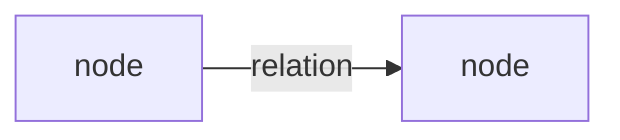

# Claim Graph

**Date:**  
**Scope:** portfolio-wide / single application + related  
**Maintainer note:**  

*Optional. Instance-triggered when portfolio lineage is hard to track by hand. Individual worksheets remain the source of truth.*

---

## Nodes

| Node ID | Type | Short label | Status / FD (if known) |
|---------|------|-------------|------------------------|
|         | Application / Lock / Anchor-class / Layer |  |  |
|         | Application / Lock / Anchor-class / Layer |  |  |
|         | Application / Lock / Anchor-class / Layer |  |  |

---

## Edges

| From | To | Relation | Notes |
|------|----|----------|-------|
|      |    | depends_on / imports_lock / shares_anchor_class / constrains / derived_from |  |
|      |    | depends_on / imports_lock / shares_anchor_class / constrains / derived_from |  |
|      |    | depends_on / imports_lock / shares_anchor_class / constrains / derived_from |  |

---

## Optional diagram

*(Omit if unused. Mermaid or plain text is fine.)*



or plain text:

```
A --depends_on--> B
```

---

## Residual judgment / known missing edges


---

## Ready for next step?

- [ ] Update after new application  
- [ ] Update after new lock  
- [ ] Freeze  
- [ ] Archive  
